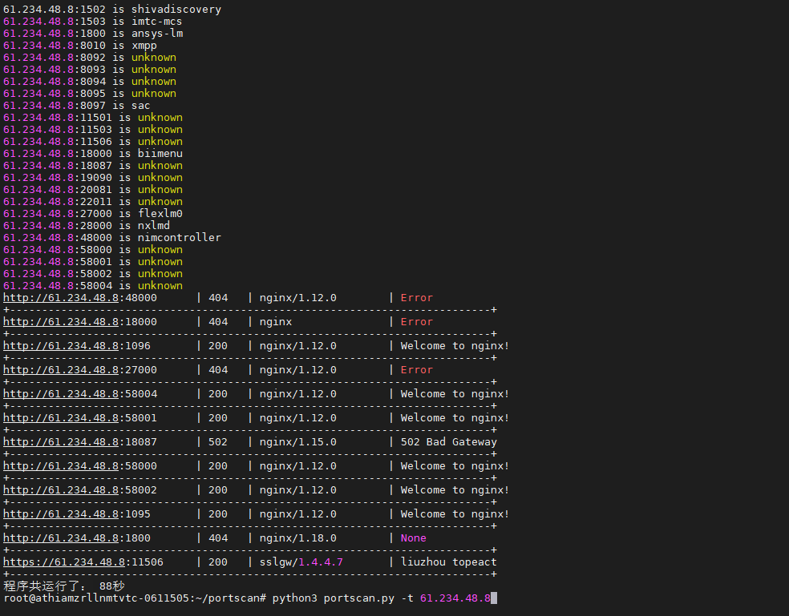

# portscan
用于批量全端口扫描,masscan+nmap+http扫描
# 用法:
python3 portscan.py -t 192.168.1.0/24  
python3 portscan.py -t target.txt  
python3 portscan.py -t qq.com  
python3 portscan.py -t target.txt  -p 80,443,8000-10000  
默认扫描http标题，若不需要则添加参数 -v 0  
python3 portscan.py -t target.txt -v 0 

支持域名,调用socket获取域名ip，对该ip进行扫描,并在结果中标注出域名，遇到cdn会出现误报

## 待更新
[-]域名扫描时，对cdn的处理优化  
[-]httptitle扫描换成协程并发

## linux
1.apt install nmap  
2.pip3 install python-nmap  
3.chmod +x masscan 或者 apt install masscan 

## windows
1.安装nmap,npcap  
2.pip3 install python-nmap  

报错处理:  
若运行后无结果,则先自查是否能运行masscan.exe  
一:双击打开masscan.exe,查看是否提示缺少xxxx.dll  
二:命令行运行，随便扫描ip,查看是否报错  

## 截图

